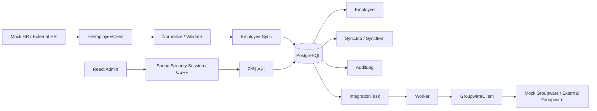
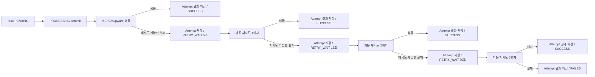
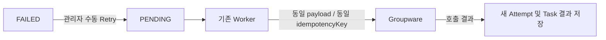
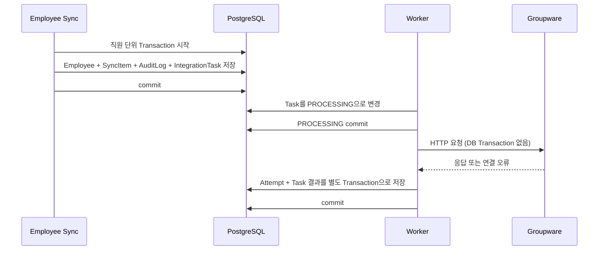

# Employee Lifecycle Sync

[](https://github.com/kimsooin77/Sync/actions/workflows/ci.yml)

## 1. 프로젝트 소개

HR 직원 정보를 내부 DB에 반영하고, 직원 상태·부서 변화에 따른 그룹웨어 계정 변경 작업과 실패 이력·재처리를 관리하는 시스템입니다.

Java 21, Spring Boot, PostgreSQL, React로 구성했습니다. 실제 HR·Groupware 제품 대신 계약을 가정한 Mock API를 사용합니다.

## 2. 해결하려는 문제

- HR 스냅샷과 내부 직원 정보를 사번 기준으로 비교해 INSERT, UPDATE, SKIP해야 합니다.
- Groupware가 느리거나 실패해도 내부 직원 반영은 유지해야 합니다.
- 같은 작업을 재전달해도 외부 계정을 중복 생성하지 않아야 합니다.
- 처리 중 프로세스가 종료되거나 재시도 예산이 소진된 작업을 운영자가 찾아 재처리할 수 있어야 합니다.
- 대량 반복 동기화에서 변경 없는 직원의 개별 조회를 줄여야 합니다.

## 3. 핵심 기능

- HR 스냅샷 조회, 정규화, 사번 중복 검증 및 행별 INSERT·UPDATE·SKIP·FAILED 기록
- Employee 변경과 AuditLog, Groupware IntegrationTask의 직원 단위 트랜잭션 처리
- 별도 Worker의 외부 호출, Attempt 이력, 5·15·30초 자동 재시도와 FAILED 수동 재시도
- idempotency key를 유지하는 재호출과 60초 이상 PROCESSING 작업 복구
- 세션 로그인과 CSRF 보호가 적용된 관리자 화면: 동기화 현황, 직원 변경 이력, Task와 Attempt, 장애 시뮬레이션
- Mock HR 시나리오와 Mock Groupware의 직원별 실패 시뮬레이션

## 4. 전체 아키텍처



## 5. 핵심 처리 흐름과 데이터 모델

HR 응답은 외부 호출 트랜잭션 밖에서 가져옵니다. 먼저 각 행을 정규화하고 중복 사번을 검사합니다. 정상 행의 기존 Employee는 사번 1,000개 단위로 조회합니다. 변경 후보는 직원별 트랜잭션 안에서 최신 Employee를 다시 읽어 최종 판정합니다. 한 행의 정규화·저장 실패는 해당 행 결과로 남기고 다음 행을 처리합니다.

```mermaid
erDiagram
    EMPLOYEE o|--o{ SYNC_ITEM : "employee_id (failed는 null)"
    SYNC_JOB ||--o{ SYNC_ITEM : contains
    EMPLOYEE ||--o{ AUDIT_LOG : changes
    SYNC_ITEM ||--o| AUDIT_LOG : "최대 1개"
    EMPLOYEE ||--o{ INTEGRATION_TASK : targets
    SYNC_ITEM ||--o| INTEGRATION_TASK : "Groupware 최대 1개"
    INTEGRATION_TASK ||--o{ INTEGRATION_ATTEMPT : records

    EMPLOYEE {
        bigint id PK
        varchar employee_no UK
        varchar name
        varchar company_email
        varchar department_code
        varchar employment_status
    }
    SYNC_JOB {
        bigint id PK
        varchar status
        int total_count
        int inserted_count
        int updated_count
        int skipped_count
        int failed_count
        timestamptz started_at
        timestamptz finished_at
    }
    SYNC_ITEM {
        bigint id PK
        bigint sync_job_id FK
        bigint employee_id FK "nullable for FAILED"
        int row_number
        varchar result
        text error_code
    }
    AUDIT_LOG {
        bigint id PK
        bigint employee_id FK
        bigint sync_item_id FK_UK
        varchar action
        text changes
        varchar source
    }
    INTEGRATION_TASK {
        bigint id PK
        bigint employee_id FK
        bigint sync_item_id FK
        varchar action
        varchar status
        uuid idempotency_key UK
        int retry_count
        int max_retry_count
        timestamptz next_retry_at
        timestamptz processing_started_at
        text payload
    }
    INTEGRATION_ATTEMPT {
        bigint id PK
        bigint integration_task_id FK
        int attempt_no
        varchar result
        int http_status
        text error_code
    }
```

ERD는 현재 V1–V6 Flyway migration의 관계와 제약을 나타냅니다. SyncItem은 직원 행 결과를 모두 기록하며, FAILED 결과에는 Employee 연결이 없습니다. SKIP에는 AuditLog와 IntegrationTask가 없습니다. INSERT·UPDATE 한 건은 AuditLog와 Groupware IntegrationTask를 각각 최대 하나 만듭니다.

## 6. 장애와 복구 설계

연결 오류, timeout, HTTP 429·500·502·503·504는 자동 재시도 대상입니다. 최초 호출 후 최대 세 번 자동 재실행하며 재시도 대기 간격은 5초, 15초, 30초입니다. 이 값은 Worker가 sleep하는 시간이 아니라 다음 처리 가능 시각입니다. 실제 재호출은 scheduler 주기와 앞선 작업 처리 시간만큼 더 늦을 수 있습니다. 따라서 최대 네 번의 HTTP 호출 뒤에도 실패하면 FAILED가 됩니다. 다른 4xx, payload 및 응답 해석 오류는 자동 재시도하지 않습니다.



같은 키와 payload의 재호출은 이미 성공한 Groupware 결과를 재사용합니다. 예를 들어 계정 생성은 성공했지만 응답이 유실되면 Worker는 timeout을 기록하고 같은 키로 재호출합니다. Mock Groupware는 성공 응답을 재사용해 계정을 중복 생성하지 않습니다. 이로써 HTTP 요청 횟수와 실제 업무 처리 횟수를 분리합니다. 현재 Mock의 멱등 기록은 메모리에 저장됩니다.

Attempt는 응답 결과까지 저장할 수 있었던 HTTP 호출만 기록합니다. payload 검증처럼 HTTP 전 오류는 Attempt 0개일 수 있고, 중단 뒤 실제 전송 여부가 불명확한 호출도 이력으로 추정하지 않습니다. 따라서 Attempt 수가 전체 네트워크 전송 횟수와 항상 같지는 않습니다.

Worker는 `PROCESSING` 시작 시각을 저장하고 기본 60초보다 오래된 작업을 복구 대상으로 찾습니다. 자동 재실행 예산이 남으면 같은 payload와 idempotency key로 다시 실행하고, 소진됐으면 추가 호출 없이 `FAILED / PROCESSING_RECOVERY_EXHAUSTED`로 처리합니다. 이 상태는 Groupware 업무가 실패했다는 확인이 아니라 자동 처리 안에서 최종 결과를 확정하지 못했다는 뜻입니다. `PROCESSING commit → HTTP 호출 → 결과 저장` 사이에 중단되면 실제 외부 요청이 전송됐는지 DB만으로 알 수 없으므로 가짜 Attempt를 생성하지 않습니다. `attemptNo`는 저장된 외부 호출 결과 이력의 순번이고, `retryCount`는 자동 재실행 예산입니다. 복구가 개입한 작업에서는 두 값이 1:1로 대응하지 않을 수 있습니다.



수동 Retry는 대상 Task를 PENDING으로 돌려 Worker에게 맡깁니다. 기존 payload, idempotency key, maxRetryCount와 Attempt는 유지하며 retryCount는 0으로 초기화합니다. Groupware 호출은 관리자 요청 안에서 하지 않습니다.

장애 모드 `NORMAL`, `DELAY`, `TIMEOUT`, `HTTP_500`, `FAIL_ONCE_THEN_SUCCESS`는 데모용이며 `simulation.groupware`의 Mock 외부 시스템에만 있습니다.

## 7. Transaction 설계

직원 변경과 그에 대한 감사·연계 작업을 한 번에 커밋하고, 외부 HTTP 호출은 Worker로 분리했습니다.



HTTP 응답을 기다리며 DB 트랜잭션이나 연결을 점유하지 않습니다. Groupware 장애가 이미 커밋된 Employee 변경을 되돌리지 않으며, 작업은 Task 상태와 Attempt로 추적합니다. Task가 처리 중인 상태와 결과 저장 사이에 프로세스가 중단되면 아래 복구 정책을 적용합니다.

## 8. 성능 개선

변경 없는 직원은 사번 1,000개 단위 bulk 조회 결과로 SKIP 처리해 Employee 개별 SELECT를 생략합니다. INSERT·UPDATE 후보는 직원별 Transaction 안에서 재조회합니다.

| Scenario | 결과 | Before median | After median | 처리 시간 감소 | Employee 조회 |
|---|---|---:|---:|---:|---|
| A: 10,000건 전체 동일 | SKIP 10,000 | 27,172.516 ms | 18,332.157 ms | 약 32.53% | 개별 10,000 → 0, bulk 0 → 10 |
| B: 1,000 UPDATE + 9,000 SKIP | UPDATE 1,000, SKIP 9,000 | 29,770.774 ms | 21,988.009 ms | 약 26.14% | 개별 10,000 → 1,000, bulk 0 → 10 |

측정 환경은 Java 21.0.6, PostgreSQL 17.11 Testcontainers입니다. 워밍업 후 각 구현을 3회씩 교차 실행하고 중앙값을 사용했습니다. 이 결과는 해당 환경에서 측정한 값입니다. SyncItem 10,000건 저장과 직원별 Transaction은 유지하므로 전체 대량 처리 구조를 재설계한 결과는 아닙니다. 원자료는 [측정 비교](docs/performance/day12-comparison.md)와 [`docs/performance`](docs/performance/)에 있습니다.

측정을 다시 실행하려면 Windows PowerShell에서 `.gradlew.bat performanceTest`, macOS/Linux에서 `./gradlew performanceTest`를 사용합니다.


## 9. 관리자 화면

- **Dashboard**: HR 시나리오 선택, Sync 실행과 SyncJob별 처리 결과
- **Employees**: 직원 상태와 필드 변경 AuditLog
- **Integrations**: 외부 Task 상태, payload snapshot, Attempt Timeline, 수동 Retry
- **Failure Simulation**: Mock Groupware의 직원별 장애 규칙

Integrations 화면에서 Task 상태와 실제 호출 이력을 함께 확인할 수 있습니다. 세션 로그인과 CSRF 보호가 적용되며, 상태 변경 요청은 로그인 후 받은 CSRF token을 사용합니다.

## 10. 실행 방법

Docker Compose가 가장 빠른 데모 경로입니다. Docker와 Compose가 설치되어 있어야 합니다.

```powershell
Copy-Item .env.example .env
# .env에서 POSTGRES_PASSWORD와 DB_PASSWORD를 같은 로컬 값으로 설정하고,
# ADMIN_USERNAME과 ADMIN_PASSWORD_HASH에 직접 만든 관리자 계정을 설정합니다.
docker compose up --build -d
docker compose ps
```

브라우저에서 `http://localhost:8080/`을 열어 로그인합니다. Compose 구성은 앱, PostgreSQL, Mock HR, Mock Groupware와 Worker를 실행합니다. 종료할 때는 아래 명령을 사용하면 DB volume을 보존합니다.

```powershell
docker compose down
```

로컬 실행, production profile, 보안 cookie, health check 및 전체 환경 설정은 [배포 안내](docs/deployment.md)를 참고하세요. Compose 실행은 로컬 데모이며 배포된 서비스가 아닙니다.

## 11. 환경변수

Compose용 `.env.example`을 복사해 사용합니다. 필수 값은 `POSTGRES_PASSWORD`, `DB_USERNAME`, `DB_PASSWORD`, `ADMIN_USERNAME`, `ADMIN_PASSWORD_HASH`입니다. DB 사용자 암호는 로컬 Compose에서 `POSTGRES_PASSWORD`와 `DB_PASSWORD`에 같은 값으로 설정합니다. 관리자 암호에는 선택한 비밀번호의 유효한 BCrypt 해시를 사용합니다.

Mock HR·Groupware와 Worker는 Compose 데모에서 활성화됩니다. 실제 연동 주소와 timeout, 프로파일별 기본값 등 전체 목록은 [배포 안내](docs/deployment.md)에 있습니다. `.env`에는 비밀 값을 넣고 Git에 커밋하지 않습니다.

## 12. 테스트와 CI

최종 문서 변경 전 실행한 검증 결과는 다음과 같습니다.

| 검증 | 결과 |
|---|---|
| Backend `clean build -x performanceTest -PfrontendDistDir=frontend/dist` | 성공, 100 tests passed |
| Frontend `npm ci`, `npm test`, `npm run build` | 성공, 3개 test file / 6 tests passed, production build 성공 |
| Performance `performanceTest` | 이번 최종화에서는 재실행하지 않음. 기준 측정 자료는 `docs/performance/day12-comparison.md`에 기록 |
| Docker image build | `docker build --tag employee-lifecycle-sync:day14 .` 성공 |
| Docker Compose 기동 및 health check | 임시 격리 project에서 DB healthy, 앱 `/actuator/health` HTTP 200; 검증 후 컨테이너 정리 |
| GitHub Actions | [run 37605939900](https://github.com/kimsooin77/Sync/actions/runs/37605939900) 성공 (`33bac890`): frontend, backend 100 tests, Docker image build 통과 |

이전 [run 37572932660](https://github.com/kimsooin77/Sync/actions/runs/37572932660)은 frontend 검증 뒤 backend 시작 단계에서 exit code 126으로 실패했고 Docker image 단계는 skip됐습니다. 원인은 workflow가 `./gradlew`로 실행하는 wrapper의 Git 모드가 `100644`였던 점입니다. [run 37574902268](https://github.com/kimsooin77/Sync/actions/runs/37574902268)에서 wrapper 모드를 `100755`로 수정해 전체 검증을 통과했습니다. 이후 [run 37575281401](https://github.com/kimsooin77/Sync/actions/runs/37575281401)에서 관리자 동기화 테스트가 시나리오 로딩 중 비활성 버튼을 클릭하는 race로 실패했습니다. 테스트가 시나리오 응답과 버튼 활성화를 기다리도록 수정한 [run 37605939900](https://github.com/kimsooin77/Sync/actions/runs/37605939900)은 frontend 테스트/build, backend clean build와 100개 테스트, Docker image build까지 모두 통과했습니다. workflow에는 자동 배포 단계가 없습니다.

## 13. 현재 한계

- 단일 애플리케이션 인스턴스와 단일 Worker를 전제로 합니다.
- Session과 HR Sync guard, Mock Groupware 계정·멱등 결과가 프로세스 메모리에 있습니다.
- 외부 HR과 Groupware 제품에 실제로 연결하지 않고 가정한 API 계약과 Mock을 사용합니다.
- SKIP 행도 SyncItem과 직원 단위 Transaction을 기록합니다.
- 같은 직원의 서로 다른 IntegrationTask 간 처리 순서는 보장하지 않습니다. Worker는 하나지만 느린 HTTP 호출이 뒤 Task 처리를 지연시킬 수 있습니다.
- 대량 처리에서 SyncItem 저장과 직원별 Transaction 수는 줄이지 않았습니다.

다중 인스턴스 운영에는 영속 멱등 저장소, 분산 동기화 잠금, 공유 세션 또는 stateless 인증, Worker 동시성 제어가 필요합니다. 현재 구성에는 포함하지 않았습니다.

## 14. 데모 순서

1. 관리자 계정으로 로그인합니다.
2. Dashboard의 HR Scenario를 `initial`로 둡니다.
3. Integrations의 Failure Simulation에서 E1002를 `HTTP_500`, E1003을 `FAIL_ONCE_THEN_SUCCESS`로 지정합니다.
4. Dashboard에서 HR Sync를 실행합니다.
5. Integrations에서 E1001 성공을 확인하고 E1003의 실패 후 자동 성공 Attempt를 확인합니다. E1002는 초기 호출과 자동 재시도 세 번, 총 네 번의 호출 뒤 FAILED가 됩니다. 재시도 대기 간격의 합은 50초이며, Worker 주기와 앞선 Task 처리 시간에 따라 실제 완료에는 더 오래 걸릴 수 있습니다.
6. E1002 규칙을 `NORMAL`로 변경하고 FAILED Task의 수동 Retry를 요청합니다. Integrations 화면의 Attempt Timeline에서 같은 Task가 Worker를 통해 처리되어 SUCCESS가 될 때까지 확인합니다.
7. E1002의 수동 재시도가 SUCCESS가 된 것을 확인한 뒤 Dashboard의 HR Scenario를 `changed`로 바꾸고 다시 Sync합니다. E1002의 `UPDATE_ACCOUNT`, E1003의 `DISABLE_ACCOUNT` Task를 확인합니다.
8. 같은 `changed` 시나리오를 다시 Sync합니다. 세 직원이 모두 SKIP되고 새 IntegrationTask가 생기지 않는지 확인합니다.

## 프로젝트 상세와 면접 준비

- [포트폴리오 요약](docs/portfolio-summary.md): 역할, 문제, 해결, 측정 성과와 기술
- [면접 예상 질문과 답변 포인트](docs/interview-questions.md): 설계 선택과 현재 한계
- [배포 및 환경 설정](docs/deployment.md)
- [Day 12 성능 측정 자료](docs/performance/day12-comparison.md)
